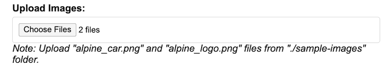
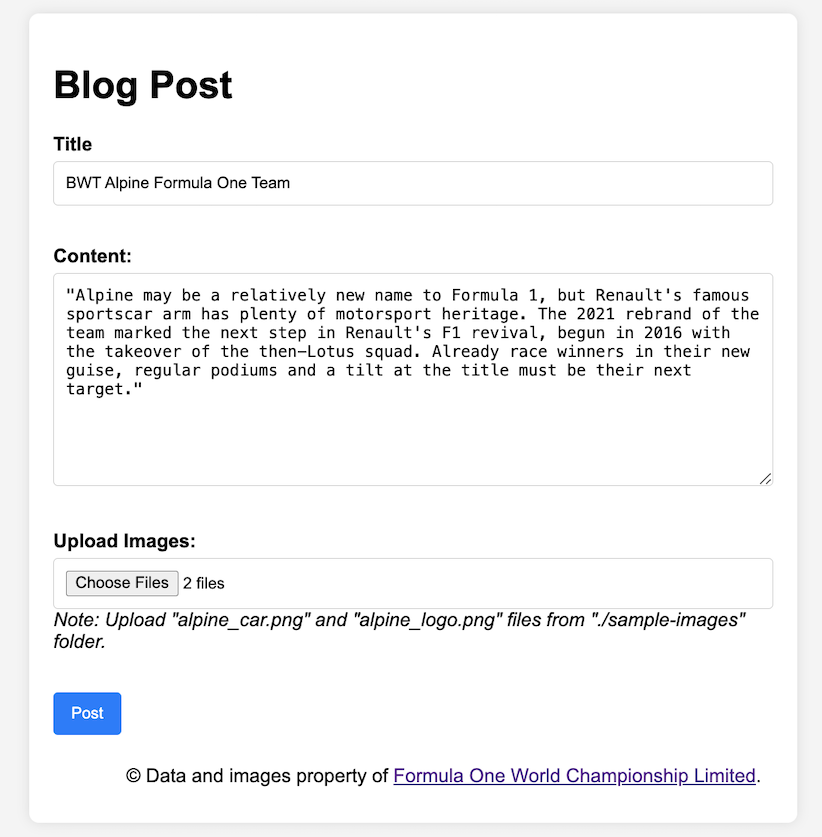
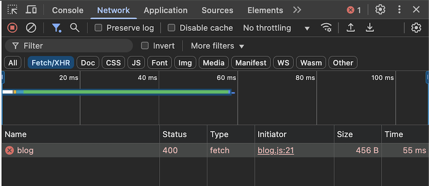
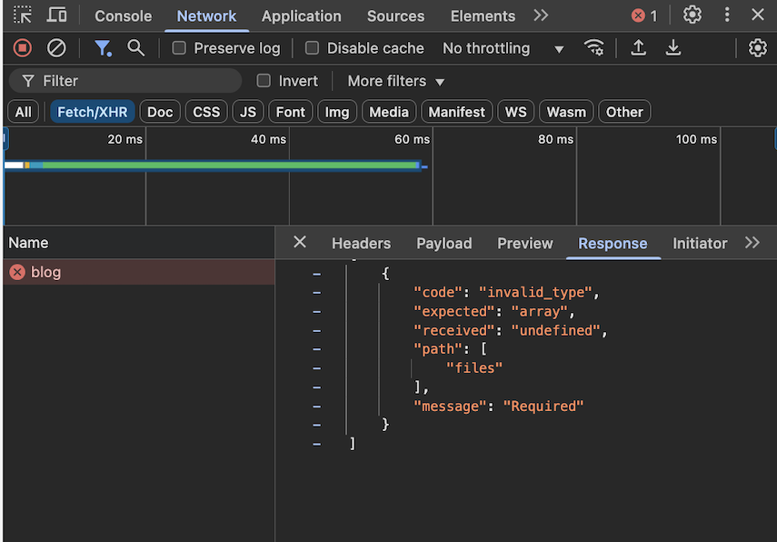

# Demo App - Zod Schema Validation

This Repo is to support a question I posted on [Stack Overflow](https://stackoverflow.com/questions/79494350/zod-schema-validation-of-formdata-with-multiple-files-failing) regarding Zod Schema Validation with multiple files.

## Table of Contents

- [Update](#update)
  - [Solution](#solution)
    - [Schema](#schema)
    - [Validator](#validator)
- [Orig Issue](#orig-issue)
- [Code](#code)
  - [HTML Form](#html-form)
  - [JavaScript](#javascript)
  - [Express Route](#express-route)
- [Schema Validation Config - Success](#schema-validation-config---success)
- [Schema Validation Config - Error](#schema-validation-config---error)
- [To Test](#to-test)
  - [Start Client App](#start-client-app)
  - [Start Api Server](#start-api-server)
  - [Submit Blog Post](#submit-blog-post)

## Update

Thanks to [traynor](https://stackoverflow.com/users/4321299/traynor) for the solution to the [issue](https://stackoverflow.com/questions/79494350/zod-schema-validation-of-formdata-with-multiple-files-failing) described below.

### Solution

"The problem is that you pass req.body to your validation middleware... but multer stores files in `req.files`, which is why it's undefined, while other fields are in `req.body`, which is why it works when files are not present. So, you'd need to include req.files in validation. Also, multer doesn't use File types, it creates custom objects ... So, you could instead validate files as array of objects." - [traynor](https://stackoverflow.com/users/4321299/traynor)

#### Schema

```Javascript
const ACCEPTED_IMAGE_TYPES = ["image/png"];

// Define a schema for a single file uploaded via Multer
const multerFile = z.object({
  fieldname: z.string(),
  originalname: z.string(),
  encoding: z.string(),
  mimetype: z.string(),
  destination: z.string(),
  filename: z.string(),
  path: z.string(),
  size: z.number()
});

// Define a schema for a blog post that includes a title, content, and 2 image files
export const blogSchema = zfd.formData({
  title: z.string().min(1).max(50),
  content: z.string().min(1),
  // Validate that the files array contains exactly 2 files, and that each file is a PNG image
  files: z.array(multerFile).min(2).max(2).refine((files) => {
    return files.every((file) => ACCEPTED_IMAGE_TYPES.includes(file.mimetype));
  })
});
```

#### Validator

```Javascript
export const validate = (schema) => (req, res, next) => {
  try {
    logger.info(JSON.stringify(req.body));

    // Validate the request body and files against the schema
    // files is an array of objects, each object representing a file uploaded via Multer
    schema.parse({ ...req.body, files: req.files });

    // If there are no errors, call the next middleware function
    next();
  } catch (err) {
    return res.status(400).send(err.errors);
  }
};
```

## Orig Issue

This App has an error when performing Zod Schema validation of FormData containing a multi-select HTML `file` input element (2 files attached).



### Code

#### HTML Form

```HTML
    <form id="blog-post">
      <div>
        <label for="title">Title</label>
        <input
        type="text"
        id="title"
        name="title"
        value="BWT Alpine Formula One Team"
        />
      </div>
      <br />
      <div>
        <label for="content">Content:</label>
        <textarea id="content" name="content" rows="10" cols="50">
"Alpine may be a relatively new name to Formula 1, but Renault's famous sportscar arm has plenty of motorsport heritage. The 2021 rebrand of the team marked the next step in Renault's F1 revival, begun in 2016 with the takeover of the then-Lotus squad. Already race winners in their new guise, regular podiums and a tilt at the title must be their next target."
        </textarea>
      </div>
      <br />
      <div>
        <label for="files">Upload Images:</label>
        <input type="file" id="files" name="files" multiple />
      </div>
      <br />
      <div>
        <button type="submit">Post</button>
      </div>
    </form>
```

#### JavaScript

```Javascript
    // Create a new FormData object
    const formData = new FormData();

    // Append the form data to the FormData object
    formData.append("title", $("#title").val());
    formData.append("content", $("#content").val());

    // Append the files to the FormData object
    const files = document.getElementById("files").files;
    for (let i = 0; i < files.length; i++) {
    formData.append("files", files[i]);
    }

  // Use fetch to post the FormData object to the server
  // This will automatically set the Content-Type header to multipart/form-data
    const response = await fetch("http://localhost:3001/blog", {
      method: "POST",
      body: formData,
    });
    console.log(await response.json());
```

#### Express Route

```Javascript
import express from "express";
import multer from "multer";

import { validate } from "../middleware/schemaValidator.js";
import { blogSchema } from "../schemas/blogSchema.js";
import { addBlogPost } from "../controllers/blogController.js";

const storage = multer.diskStorage({
  destination: (_req, _file, cb) => {
    cb(null, "public/uploads/");
  },
  filename: (_req, file, cb) => {
    cb(null, file.originalname);
  },
});
const upload = multer({ storage });

const router = express.Router();

// Validate the blogSchema before adding a new blog post
// The validate function will return an error if the request body does not match the schema
// If there is no error, the addBlogPost function will be called
router.post("/", upload.array("files", 2), validate(blogSchema), addBlogPost);

export default router;
```

### Schema Validation Config - Success

When validating only the FormData's `title` and `content` properties, validation is successful.

#### blogSchema.js

```Javascript
const ACCEPTED_IMAGE_TYPES = ["image/png"];

export const blogSchema = zfd.formData({
  title: z.string(),
  content: z.string(),
  // files: z.array(z.instanceof(File)).refine((files) => {
  //   return files.every((file) => ACCEPTED_IMAGE_TYPES.includes(file.type));
  // }),
});

```

#### Response

Note: `uuid` is generated on the server before the response is sent back to the client.

```Javascript
{
    "title": "BWT Alpine Formula One Team",
    "content": "\"Alpine may be a relatively new name to Formula 1, but Renault's famous sportscar arm has plenty of motorsport heritage. The 2021 rebrand of the team marked the next step in Renault's F1 revival, begun in 2016 with the takeover of the then-Lotus squad. Already race winners in their new guise, regular podiums and a tilt at the title must be their next target.\"\r\n          ",
    "uuid": "09ca5679-d841-42dc-8618-b20942f22159"
}
```

### Schema Validation Config - Error

When validation includes the FormData's `files` property, validation fails because `files` is `undefined`.

#### blogSchema.js

```Javascript
const ACCEPTED_IMAGE_TYPES = ["image/png"];

export const blogSchema = zfd.formData({
  title: z.string(),
  content: z.string(),
  files: z.array(z.instanceof(File)).refine((files) => {
    return files.every((file) => ACCEPTED_IMAGE_TYPES.includes(file.type));
  }),
});
```

#### Response

```Javascript
[
    {
      "code": "invalid_type",
      "expected": "array",
      "received": "undefined",
      "path": [
        "files"
      ],
      "message": "Required"
    }
]
```

### To Test

#### Start Client App

1. Open Terminal in the `client-app` dir
2. Execute `npm install && npm start`

#### Start Api Server

1. Open Terminal in the `api-server` dir
2. Execute `npm install && npm run dev`

#### Submit Blog Post

1. Launch [http://localhost:3000](http://localhost:3000) in Browser.
2. Select `alpine_car.png` and `alpine_logo.png` files from `./sample-images` folder in the `Upload Images` HTML file element.
3. Submit Blog post

##### Populated Form



##### Error Response




